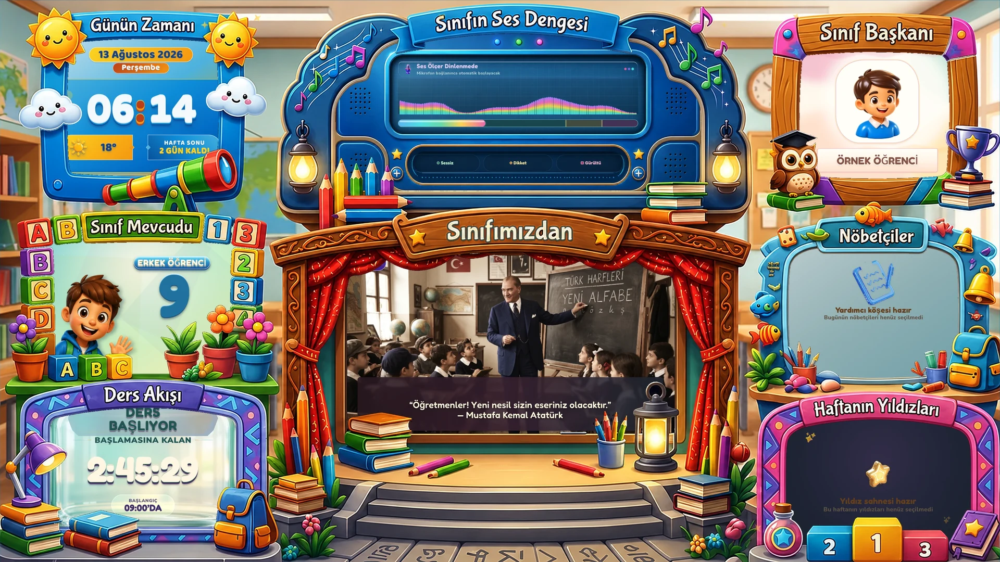
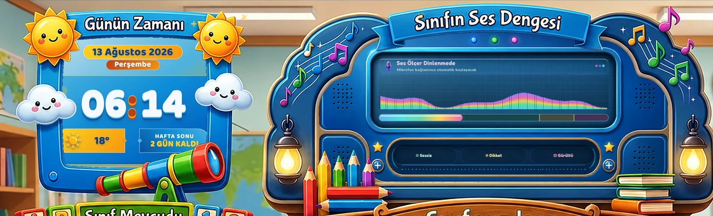
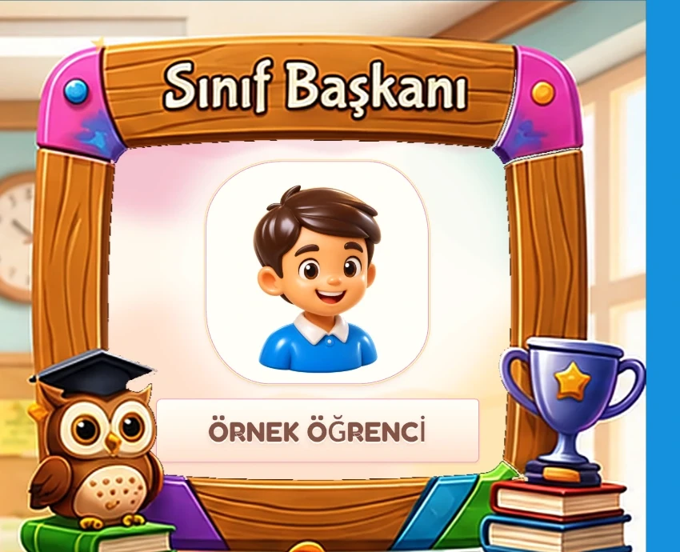

# Classroom — 2/D Sihirli Pano

<p align="center">
  <strong>İlkokul sınıfı için 4K öğrenci kiosku + güvenli öğretmen yönetim paneli</strong><br>
  Magic Park görsel sistemi, gerçek zamanlı sınıf araçları ve yerel-first çalışma modeli.
</p>

<p align="center">
  <a href="https://github.com/bingoweb/Classroom/actions/workflows/core-tests.yml"></a>
  
  
  
  
</p>

<p align="center">
  
</p>

Classroom, sınıftaki büyük ekranda sürekli çalışan **2/D Sihirli Pano / Sihirli Öğrenme Parkı (Magic Park)** ile öğretmenin günlük işlemlerini yönettiği **Admin Paneli**ni aynı uygulamada birleştirir.

Projenin odağı yalnızca bilgi göstermek değil; saati, ders akışını, sınıf mevcudunu, ses seviyesini ve sınıf içi rolleri çocukların uzaktan rahat okuyabileceği, canlı ve eğlenceli bir sınıf yüzeyine dönüştürmektir. Ana kiosk gerçek **16:9** sahne olarak tasarlanır ve 4K ekran kullanımını hedefler.

> Ekran görüntülerindeki öğrenci adı gizlilik nedeniyle örnek veriyle anonimleştirilmiştir. Repo içindeki gerçek öğrenci verisi ekran görüntülerine taşınmaz.

## Ekran görüntüleri

<table>
  <tr>
    <td width="68%">
      
    </td>
    <td width="32%">
      
    </td>
  </tr>
  <tr>
    <td><strong>Üst kontrol alanı</strong><br>Günün zamanı, hava durumu ve çocuk dostu Sihirli Ses Konsolu.</td>
    <td><strong>Sınıf Başkanı</strong><br>Yalnız fotoğraf + isim; dış artwork ile optik olarak hizalanmış box-local tasarım.</td>
  </tr>
</table>

## Magic Park neler gösteriyor?

Ana kiosk tek 16:9 sahnede sekiz canlı bölge kullanır:

| Bölge | Güncel davranış |
| --- | --- |
| **Günün Zamanı** | Gün, tarih, büyük dijital saat, Gölbaşı hava durumu ve hafta sonu bağlamı |
| **Sınıf Mevcudu** | Toplam / kız / erkek öğrenci sayısının üç sahneli çocuk animasyonu |
| **Ders Akışı** | Saniyelik ders-teneffüs sayacı, mevcut/sıradaki dönem ve fizik tabanlı gazoz kavanozu |
| **Sınıfın Ses Dengesi** | Web Audio mikrofon pipeline'ı, 128 bant equalizer, otomatik mikrofon bağlantısı ve demo modu |
| **Sınıfımızdan** | Görsel, GIF ve video slaytları; öğretmen içeriği yoksa Atatürk fallback yayını |
| **Sınıf Başkanı** | Yalnız başkan fotoğrafı ve adı; yardımcılar Class TV içeriğinde kalır |
| **Nöbetçiler** | Günlük görevli öğrenciler |
| **Haftanın Yıldızları** | Yıldız öğrenciler için mini slideshow |

### Ders Akışı

Ders Akışı basit bir progress bar değildir. Kutunun içinde **Three.js + LiquidFun** tabanlı portakallı gazoz kavanozu bulunur. Sıvı yüksekliği gerçek ders/teneffüs ilerlemesine bağlıdır; fiziksel kabarcıklar, mikro kabarcıklar, cam kenarı davranışı, menisküs, kırılma ve fallback CSS dolumu aynı zaman kaynağıyla senkronize edilir.

Paket sahipliği:

```text
public/themes/magic-park/boxes/lesson-flow/
├── lesson-flow.css
├── lesson-flow.json
├── lesson-flow.js
├── liquid-physics.js
└── assets/
```

### Sınıfın Ses Dengesi

Noise Meter gerçek mikrofon bulunduğunda otomatik devralır; mikrofon yokken equalizer ve alt seviye çubuğu yalnız görsel demo olarak çalışır. Manuel "Tekrar Dene" katmanı yoktur. `devicechange` üzerinden yeni mikrofon algılandığında ölçüm yeniden bağlanır.

Aktif Magic Park paketi:

```text
public/themes/magic-park/boxes/noise-meter/
├── noise-meter.css
├── noise-meter.json
└── assets/noise-console-panel.webp
```

### Sınıf Başkanı

Başkan kutusu dış çerçevedeki mevcut `Sınıf Başkanı` başlığını tekrar etmez. Canlı içeriğin tamamı **fotoğraf + isim** ile sınırlıdır. Koyu kart/taç/slogan yaklaşımı kaldırılmış; açık krem-şeftali iç yüzey, organik fotoğraf çerçevesi ve açık isim plakası kullanılmıştır.

Kutunun görsel sahipliği ortak CSS'e değil kendi paketine aittir:

```text
public/themes/magic-park/boxes/president/
├── president.css
├── president.json
├── README.md
└── assets/president-stage.webp
```

Fotoğraf ve isim, kartın kaba bounding-box merkezine değil foreground artwork'ün ölçülmüş **gerçek optik açıklığına** hizalanır. Bu sayede 1080p ve 4K'da sağa/yukarı kayma oluşturan generic transformlar Başkan kutusunun geometrisini bozamaz.

## Kutu paket mimarisi

Magic Park geliştirmesinde kutuya özel sunumun generic tema CSS'ine yayılmaması temel prensiptir. Yenilenen kutular `public/themes/magic-park/boxes/<kutu>/` altında kendi stil/manifest/asset sahipliğini taşır.

```text
public/themes/magic-park/
├── theme.css
├── magic-layout.css
├── magic-components.css
└── boxes/
    ├── attendance/
    ├── clock/
    ├── lesson-flow/
    ├── noise-meter/
    └── president/
```

Ana Magic Park foreground artwork'ü gerçek alpha açıklıkları kullanır. Canlı DOM içeriği bu açıklıkların arkasında çalışır; dekoratif çerçeve ise üst katmanda kalır. Böylece CSS ile ikinci kez sahte çerçeve çizmek yerine görsel ve canlı içerik tek kompozisyon gibi davranır.

## Öğretmen Admin Paneli

Admin ana navigasyonu günlük sınıf işlerine odaklanır:

- **Öğrenciler:** öğrenci ekleme/silme, fotoğraf güncelleme, arama/filtreleme, Excel import.
- **Görevler:** başkan, en fazla iki yardımcı, nöbetçiler ve yıldız öğrenciler.
- **Yoklama:** tarih bazlı `present / absent` yönetimi ve toplu kayıt.
- **Slaytlar:** image/GIF/video yükleme, caption, süre, transition, aktif/pasif ve sıralama.

Öğretmen slaytı bulunmadığında kiosk boş kalmaz. Yedi canonical Atatürk slaytı **system-owned fallback** olarak startup sırasında idempotent biçimde reconcile edilir; admin listesinden değiştirilemez veya silinemez.

## Teknoloji

| Katman | Teknoloji |
| --- | --- |
| Frontend | HTML, CSS, Vanilla JavaScript |
| Backend | Node.js + Express 4.22.2 |
| Veritabanı | SQLite / sqlite3 6.0.1 |
| Upload | Multer 2.2.0 |
| Excel | SheetJS 0.20.3, yerel runtime |
| Motion | GSAP 3.15.0, canvas-confetti 1.9.4 |
| 3D / fizik | Three.js 0.185.1, LiquidFun vendor runtime |
| Fontlar | Yerel Fredoka + Nunito Sans |

Frontend framework kullanılmaz. Kiosk, admin, statik dosyalar ve `/api/*` endpointleri tek Express uygulaması tarafından servis edilir.

Admin Excel çalışma zamanı SheetJS paketinden yerel olarak servis edilir; **dış CDN'e bağımlı değildir**.

## Hızlı kurulum

Gereksinim:

```text
Node.js >=22 <25
npm
```

Bağımlılıkları lockfile üzerinden kurun:

```bash
npm ci
```

Admin parolasını environment üzerinden verip uygulamayı başlatın:

```bash
export CLASSROOM_ADMIN_PASSWORD='guclu-bir-parola'
npm start
```

İsteğe bağlı kullanıcı adı:

```bash
export CLASSROOM_ADMIN_USERNAME='admin'
```

Uygulama açıldığında:

| Yüzey | Adres |
| --- | --- |
| Kiosk | `http://localhost:3000/` |
| Admin login | `http://localhost:3000/admin-login.html` |
| Admin panel | `http://localhost:3000/admin/` |

`CLASSROOM_ADMIN_PASSWORD` ayarlı değilse public kiosk çalışmaya devam eder fakat admin login **fail-closed** olarak 503 döner. Repo içinde fallback parola veya commit edilmiş parola digest'i bulunmaz.

### Linux kiosk başlatma

```bash
./start.sh
```

Script backend'i başlatır ve uygun tarayıcı bulunduğunda Chromium / Chrome / Firefox kiosk modunu açar.

## Veritabanı

Varsayılan SQLite dosyası:

```text
backend/classroom.db
```

Ana tablolar:

```text
students
roles
settings
attendance
schedule
slides
slide_settings
error_logs
```

Backend ve admin tarih anahtarları **Europe/Istanbul** takvim gününe göre üretilir. Test/bakım araçları gerçek sınıf veritabanı yerine mümkün olduğunda `CLASSROOM_DB_PATH` ile izole temp DB kullanır.

## Güvenlik yaklaşımı

Admin mutasyonlarında server-side session, HttpOnly cookie, `SameSite=Strict`, session'a bağlı CSRF token, login/write rate limit, same-origin politika, managed upload path kontrolü, hata redaction ve kritik SQLite işlemlerinde transaction/rollback kullanılır.

Secret değerleri Git'e yazılmamalıdır. `.env`, `.env.local` ve `.env.production` çalışma dosyaları repository dışında tutulur.

## Test ve kalite kapıları

Ana test paketi:

```bash
npm run test:core
```

Bu suite schedule, admin auth/session/CSRF/rate limit, öğrenci ve fotoğraf işlemleri, roller, yoklama, slayt cache/transaction davranışları, error redaction, Magic Park, native SQLite, Multer multipart runtime ve bakım smoke testlerini kapsar.

Diğer önemli kontroller:

```bash
npm run test:kiosk-magic-park
npm run test:system-smoke
npm run test:dependency-security-baseline
npm run test:sqlite-native-smoke
npm run test:multer-runtime-smoke
npm run verify:code
```

GitHub Actions aynı `test:core` kapısını **Node 22 ve Node 24** üzerinde çalıştırır.

## Proje yapısı

```text
backend/                      Express, SQLite ve API modülleri
public/                       kiosk + admin statik uygulaması
public/admin/                 öğretmen yönetim paneli
public/js/                    kiosk runtime modülleri
public/css/                   ortak kiosk stil katmanları
public/themes/magic-park/     aktif Magic Park tema paketi
docs/images/                  README için anonimleştirilmiş ekran görüntüleri
scripts/                      seed, bakım ve smoke araçları
tests/                        Node test suite
docs/                         teknik raporlar ve tasarım kayıtları
Classroom Projesi/            yaşayan geliştirme / devir belgeleri
```

## Güncel teknik belgeler

Değişen teknik ayrıntılarda **Git HEAD kaynak gerçeklik / source of truth** kabul edilir. Yaşayan açık işler ve tamamlanan bakım kanıtları için `Classroom Projesi/01 - Güncel Belgeler/Classroom Projesi — Önceliklendirilmiş Düzeltme Planı — 2026-08-08.md` kullanılır; tarihsel belgeler mevcut HEAD davranışını override etmez.

Daha derin bilgi için:

- [`docs/PROJE_OZETI.md`](docs/PROJE_OZETI.md) — güncel insan-okur mimari özeti.
- [`AI_PROJECT_CONTEXT.md`](AI_PROJECT_CONTEXT.md) — geliştirme oturumları için kısa devir bağlamı.
- [`CLASSROOM_PROJE_TOMOGRAFISI_2026-08-08.md`](CLASSROOM_PROJE_TOMOGRAFISI_2026-08-08.md) — kapsamlı repo/mimari taraması.
- [`docs/DERS_AKISI_GELISTIRME_RAPORU_2026-08-12.md`](docs/DERS_AKISI_GELISTIRME_RAPORU_2026-08-12.md) — Ders Akışı fizik ve görsel sistem raporu.
- [`docs/BASKAN_KUTUSU_GELISTIRME_RAPORU_2026-08-13.md`](docs/BASKAN_KUTUSU_GELISTIRME_RAPORU_2026-08-13.md) — Başkan kutusu tasarım, optik hizalama ve kabul kaydı.
- [`docs/DEVELOPMENT_TOOLCHAIN.md`](docs/DEVELOPMENT_TOOLCHAIN.md) — geliştirme araç zinciri.
- [`docs/GRAPHICS_ASSET_TOOLCHAIN.md`](docs/GRAPHICS_ASSET_TOOLCHAIN.md) — grafik/asset üretim ve doğrulama süreci.

## Geliştirme ilkesi

Bir değişiklik tamamlanmış sayılmadan önce hedef sorun yeniden üretilir veya regression testiyle kilitlenir; ilgili testler, komşu regresyonlar ve mümkün olduğunda `npm run test:core` çalıştırılır. Görsel değişiklikler gerçek browser kabulüyle 1080p/4K ölçekte doğrulanır.

Bu repository aktif olarak sınıfta kullanılmak üzere geliştirilen yaşayan bir projedir; eski belgelerdeki tarihsel prototipler mevcut `main` dalının davranışını override etmez.
