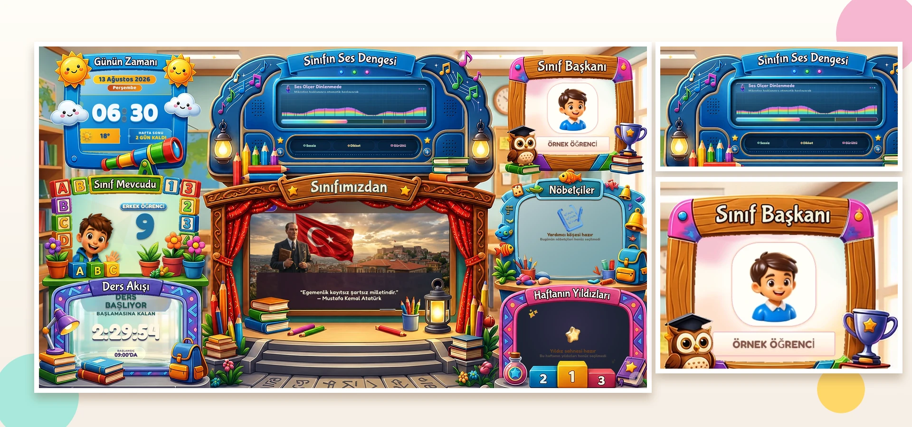
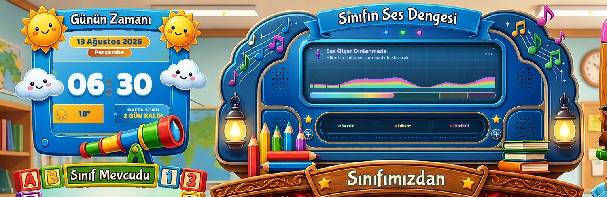
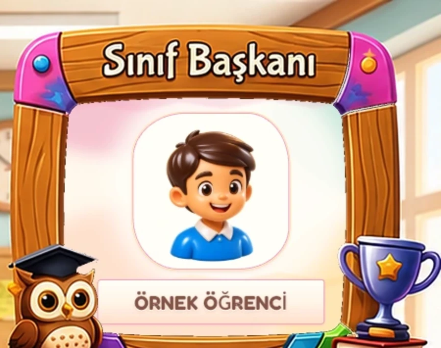
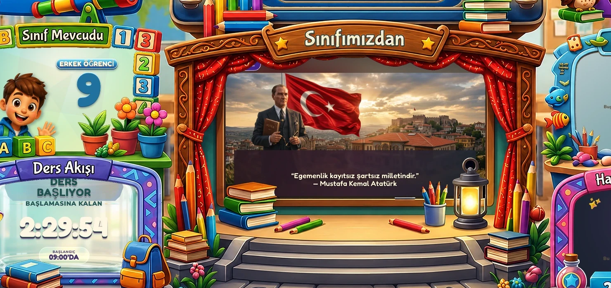
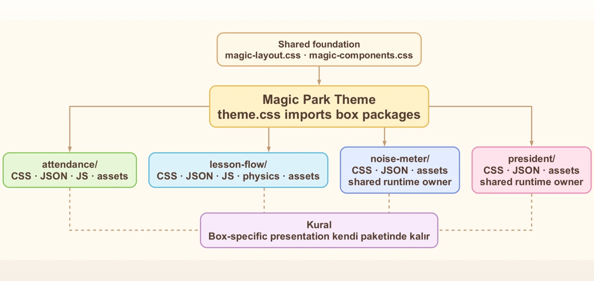

# Classroom — 2/D Sihirli Pano

<p align="center">
  <strong>Gerçek sınıf için tasarlanmış 4K Magic Park kiosku ve güvenli öğretmen yönetim sistemi.</strong><br>
  Canlı ders akışı · ses dengesi · sınıf rolleri · medya yayını · yerel-first çalışma modeli
</p>

<p align="center">
  <a href="https://github.com/bingoweb/Classroom/actions/workflows/core-tests.yml"></a>
  
  
  
  
</p>

<p align="center">
  
</p>

Classroom, sınıftaki büyük ekranda sürekli çalışan **2/D Sihirli Pano / Sihirli Öğrenme Parkı (Magic Park)** ile öğretmenin günlük işlemlerini yönettiği **Admin Paneli**ni tek uygulamada birleştirir. Kiosk; saat, ders akışı, sınıf mevcudu, ses seviyesi, medya yayını ve sınıf rollerini çocukların uzaktan rahat okuyabileceği canlı bir 16:9 sahneye dönüştürür.

> **Sınıfta kullanılmak üzere geliştiriliyor.** Magic Park browser içinde çalışan sıradan bir dashboard değil; 4K büyük ekran, uzaktan okunabilirlik, fiziksel mikrofon, gerçek ders zamanı ve öğretmen iş akışı birlikte düşünülerek tasarlanıyor.

> Public ekran görüntülerindeki öğrenci adı gizlilik nedeniyle **ÖRNEK ÖĞRENCİ** olarak anonimleştirilmiştir. Screenshot hazırlığı gerçek öğrenci verisini değiştirmez.

## Neden Classroom?

<table>
  <tr>
    <td width="50%"><strong>🖥️ Gerçek 4K sınıf kiosku</strong><br>Magic Park sabit 16:9 sahne, büyük TV okunabilirliği ve 1080p/4K browser kabulü gözetilerek geliştiriliyor.</td>
    <td width="50%"><strong>🎡 Paketlenmiş Magic Park kutuları</strong><br>Yenilenen her kutu kendi görsel sözleşmesini, CSS/JSON sahipliğini ve gerektiğinde JS/assetlerini taşıyor.</td>
  </tr>
  <tr>
    <td><strong>⏱️ Gerçek zamanlı Ders Akışı</strong><br>Ders ve teneffüs zamanı saniyelik ilerliyor; fizik tabanlı gazoz kavanozu aynı zaman kaynağıyla doluyor.</td>
    <td><strong>🎚️ Otomatik Ses Dengesi</strong><br>Mikrofon bağlandığında Web Audio ölçümü otomatik devralıyor; mikrofon yokken yalnız görsel demo çalışıyor.</td>
  </tr>
  <tr>
    <td><strong>🧑‍🏫 Sınıf rolleri ve yayın</strong><br>Başkan, yardımcılar, nöbetçiler, yıldızlar, yoklama ve öğretmen slaytları tek sınıf verisi üzerinde birleşiyor.</td>
    <td><strong>🔐 Güvenli local-first yönetim</strong><br>Admin session, CSRF, rate limit, managed upload ve SQLite transaction katmanlarıyla korunuyor.</td>
  </tr>
</table>

## Magic Park spotlight

### Günün Zamanı + Sihirli Ses Konsolu

<p align="center">
  
</p>

- Büyük dijital saat, tarih ve Gölbaşı hava durumu uzaktan okunacak ölçekte sunulur.
- Noise Meter 128 bantlı equalizer ve alt seviye göstergesini tek elektronik konsol dili içinde birleştirir.
- Mikrofon `devicechange` ile geldiğinde gerçek analyser verisi demo animasyonunu otomatik devralır.

### Sınıf Başkanı + Class TV

<table>
  <tr>
    <td width="34%" valign="top">
      
    </td>
    <td width="66%" valign="top">
      
    </td>
  </tr>
  <tr>
    <td valign="top"><strong>Sınıf Başkanı</strong><br>Canlı içerik yalnız fotoğraf + isimdir. Dış artwork başlığı zaten taşıdığı için ikinci başlık veya slogan üretilmez.</td>
    <td valign="top"><strong>Class TV + Ders Akışı</strong><br>Merkez yayın alanı öğretmen medyasını ve sistem fallback içeriğini taşırken Ders Akışı gerçek sınıf zamanını takip eder.</td>
  </tr>
</table>

Başkan fotoğrafı ve isim plakası kaba kart merkezine değil foreground artwork'ün ölçülmüş **gerçek optik açıklığına** hizalanır. Ders Akışı ise Three.js + LiquidFun tabanlı portakallı gazoz hacmi, fiziksel kabarcıklar ve CSS fallback ile aynı ilerleme yüzdesini paylaşır.

## Canlı sınıf araçları

| Alan | Öğrencinin gördüğü davranış |
| --- | --- |
| **Günün Zamanı** | Gün, tarih, büyük saat, Gölbaşı sıcaklığı ve hafta sonu bağlamı |
| **Sınıf Mevcudu** | Toplam / kız / erkek öğrenci sayısının sahneli çocuk animasyonu |
| **Ders Akışı** | Saniyelik ders-teneffüs sayacı ve fizik tabanlı gazoz kavanozu |
| **Sınıfın Ses Dengesi** | Mikrofon ölçümü, 128 bant equalizer ve Sessiz / Dikkat / Gürültü durumları |
| **Sınıfımızdan** | Görsel, GIF ve video yayını; içerik yoksa system-owned Atatürk fallback seti |
| **Sınıf Başkanı** | Yalnız başkan fotoğrafı + adı; yardımcılar Class TV içeriğinde kalır |
| **Nöbetçiler** | Günün görevli öğrencileri |
| **Haftanın Yıldızları** | Yıldız öğrenciler için mini slideshow |

## Magic Park kutu mimarisi

<p align="center">
  
</p>

Magic Park'ta kutuya özel sunumun generic tema CSS'ine yayılmaması temel mimari kuraldır:

- geliştirilen kutu kendi **CSS + JSON** sahipliğini taşır,
- gerektiğinde JS, fizik kodu ve görsel assetler aynı pakette yaşar,
- `magic-layout.css` / `magic-components.css` ortak foundation sağlar; box-specific presentation taşımaz,
- foreground artwork'ün alpha açıklığı ile canlı DOM ayrı katmanlardır.

```text
public/themes/magic-park/boxes/
├── attendance/
├── clock/
├── lesson-flow/
├── noise-meter/
└── president/
```

### Öne çıkan paketler

| Paket | Sahip olduğu özel sistem |
| --- | --- |
| `lesson-flow/` | CSS + JSON + JS + LiquidFun/Three.js fizik/optik katmanı + assetler |
| `noise-meter/` | CSS + JSON + elektronik konsol asseti; gerçek audio runtime `public/js/noise-meter.js` |
| `president/` | CSS + JSON + açık iç yüzey asseti; fotoğraf ve isim için optik geometri |
| `attendance/` | CSS + JSON + JS + sınıf mevcudu sahne akışı |

## Öğretmen Admin Paneli

<table>
  <tr>
    <td width="50%"><strong>👧 Öğrenciler</strong><br>Ekleme/silme, fotoğraf güncelleme, arama, filtreleme ve Excel import.</td>
    <td width="50%"><strong>🏅 Görevler</strong><br>Başkan, en fazla iki yardımcı, nöbetçiler ve yıldız öğrenciler.</td>
  </tr>
  <tr>
    <td><strong>✅ Yoklama</strong><br>Tarih bazlı present / absent kaydı ve toplu replacement transaction.</td>
    <td><strong>🎞️ Slaytlar</strong><br>Image/GIF/video, caption, süre, transition, aktif/pasif ve sıralama yönetimi.</td>
  </tr>
</table>

Öğretmen içeriği bulunmadığında kiosk boş kalmaz. Yedi canonical Atatürk slaytı **system-owned fallback** olarak startup sırasında idempotent biçimde reconcile edilir; admin listesinden değiştirilemez veya silinemez.

## Teknik omurga

| Katman | Teknoloji |
| --- | --- |
| Frontend | HTML, CSS, Vanilla JavaScript |
| Backend | Node.js + Express **4.22.2** |
| Veritabanı | SQLite / sqlite3 **6.0.1** |
| Upload | Multer **2.2.0** |
| Excel | SheetJS **0.20.3**, yerel runtime |
| Motion | GSAP **3.15.0**, canvas-confetti **1.9.4** |
| 3D / fizik | Three.js **0.185.1**, LiquidFun vendor runtime |
| Ses | Web Audio API + analyser pipeline |
| Fontlar | Yerel Fredoka + Nunito Sans |

Frontend framework kullanılmaz. Kiosk, admin, statik dosyalar ve `/api/*` endpointleri tek Express uygulaması tarafından servis edilir.

Admin Excel çalışma zamanı SheetJS paketinden yerel olarak servis edilir; **dış CDN'e bağımlı değildir**.

## 3 adımda çalıştır

**Gereksinim:** `Node.js >=22 <25` ve npm.

```bash
npm ci
export CLASSROOM_ADMIN_PASSWORD='guclu-bir-parola'
npm start
```

Opsiyonel admin kullanıcı adı:

```bash
export CLASSROOM_ADMIN_USERNAME='admin'
```

| Yüzey | Adres |
| --- | --- |
| Kiosk | `http://localhost:3000/` |
| Admin login | `http://localhost:3000/admin-login.html` |
| Admin panel | `http://localhost:3000/admin/` |

`CLASSROOM_ADMIN_PASSWORD` tanımlı değilse public kiosk çalışmaya devam eder; admin login ise **fail-closed** davranarak 503 döner. Repo içinde fallback parola veya commit edilmiş parola digest'i yoktur.

### Linux kiosk başlatma

```bash
./start.sh
```

`start.sh` backend'i açar ve uygun tarayıcı bulunduğunda Chromium / Chrome / Firefox kiosk modunu kullanır.

## Güvenlik ve local-first çalışma modeli

Admin mutasyonlarında şu katmanlar birlikte çalışır:

- server-side in-memory session + HttpOnly cookie,
- `SameSite=Strict`,
- session'a bağlı CSRF token,
- login ve admin write rate limit,
- same-origin browser politikası,
- managed upload path kontrolü,
- hata response redaction,
- kritik SQLite işlemlerinde transaction / rollback.

Secret değerleri Git'e yazılmamalıdır. `.env`, `.env.local` ve `.env.production` çalışma dosyaları repository dışında tutulur. Backend ve admin tarih anahtarları **Europe/Istanbul** takvim gününü kullanır.

<details>
<summary><strong>Veritabanı ve ana tablolar</strong></summary>

Varsayılan SQLite dosyası:

```text
backend/classroom.db
```

Ana tablolar:

```text
students
roles
settings
attendance
schedule
slides
slide_settings
error_logs
```

Test ve bakım araçları mümkün olduğunda gerçek sınıf DB'si yerine `CLASSROOM_DB_PATH` ile izole temp DB kullanır.

</details>

## Test ve kalite kapıları

Ana kalite kapısı:

```bash
npm run test:core
```

Bu suite; schedule, auth/session/CSRF/rate-limit, öğrenci/fotoğraf/import, roller, yoklama, slayt transaction/cache, error redaction, Magic Park, native SQLite, Multer multipart runtime ve bakım smoke davranışlarını kapsar.

```bash
npm run test:kiosk-magic-park
npm run test:system-smoke
npm run test:dependency-security-baseline
npm run test:sqlite-native-smoke
npm run test:multer-runtime-smoke
npm run verify:code
```

GitHub Actions aynı `test:core` kalite kapısını **Node 22 ve Node 24** üzerinde çalıştırır.

## Proje yapısı

```text
backend/                      Express, SQLite ve API modülleri
public/                       kiosk + admin statik uygulaması
public/admin/                 öğretmen yönetim paneli
public/js/                    kiosk runtime modülleri
public/css/                   ortak kiosk stil katmanları
public/themes/magic-park/     aktif Magic Park tema paketi
docs/images/                  anonimleştirilmiş GitHub showcase görselleri
scripts/                      seed, bakım ve smoke araçları
tests/                        Node test suite
docs/                         teknik raporlar ve tasarım kayıtları
Classroom Projesi/            yaşayan geliştirme / devir belgeleri
```

## Güncel teknik belgeler

Değişen teknik ayrıntılarda **Git HEAD kaynak gerçeklik / source of truth** kabul edilir. Yaşayan açık işler ve tamamlanan bakım kanıtları için `Classroom Projesi/01 - Güncel Belgeler/Classroom Projesi — Önceliklendirilmiş Düzeltme Planı — 2026-08-08.md` kullanılır; tarihsel belgeler mevcut HEAD davranışını override etmez.

- [`docs/PROJE_OZETI.md`](docs/PROJE_OZETI.md) — güncel insan-okur mimari özeti.
- [`AI_PROJECT_CONTEXT.md`](AI_PROJECT_CONTEXT.md) — geliştirme oturumları için kısa devir bağlamı.
- [`CLASSROOM_PROJE_TOMOGRAFISI_2026-08-08.md`](CLASSROOM_PROJE_TOMOGRAFISI_2026-08-08.md) — kapsamlı repo/mimari taraması.
- [`docs/DERS_AKISI_GELISTIRME_RAPORU_2026-08-12.md`](docs/DERS_AKISI_GELISTIRME_RAPORU_2026-08-12.md) — Ders Akışı fizik ve görsel sistem raporu.
- [`docs/BASKAN_KUTUSU_GELISTIRME_RAPORU_2026-08-13.md`](docs/BASKAN_KUTUSU_GELISTIRME_RAPORU_2026-08-13.md) — Başkan kutusu tasarım, optik hizalama ve kabul kaydı.
- [`docs/DEVELOPMENT_TOOLCHAIN.md`](docs/DEVELOPMENT_TOOLCHAIN.md) — geliştirme araç zinciri.
- [`docs/GRAPHICS_ASSET_TOOLCHAIN.md`](docs/GRAPHICS_ASSET_TOOLCHAIN.md) — grafik/asset üretim ve doğrulama süreci.

## Geliştirme ilkesi

Bir değişiklik tamamlanmış sayılmadan önce hedef sorun yeniden üretilir veya regression testiyle kilitlenir; ilgili testler, komşu regresyonlar ve mümkün olduğunda `npm run test:core` çalıştırılır. Görsel değişiklikler gerçek browser kabulüyle 1080p/4K ölçekte doğrulanır.

Bu repository aktif olarak sınıfta kullanılmak üzere geliştirilen yaşayan bir projedir; eski belgelerdeki tarihsel prototipler mevcut `main` dalının davranışını override etmez.
